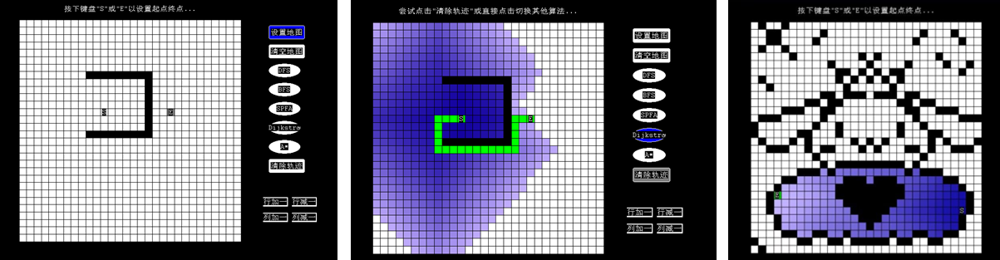

# 网格地图构建与寻路算法可视化

这是一个可视化寻路算法演示工具，旨在为图形学领域的学习者提供帮助。该系统具备多种基本寻路算法的演示和比较功能，同时还允许用户动态设置地图障碍物、更改地图尺寸、设置起点和终点等操作。通过该可视化工具，学习者能够更加直观地了解各种寻路算法的实现原理和效果，提高他们的算法实践能力。此外，用户也可以通过该系统进行算法的调试和比较，从而深入理解和认识寻路算法

# 安装与使用

可以通过打开已经编译好的项目exe文件运行程序，也可以通过IDE编译项目文件以使用该项目。默认安装和典型使用流程如下：
1. 下载 EasyX Graphics Library（<https://easyx.cn/>)）安装包，解压并安装。
2. 下载本程序源代码并解压缩到本地文件夹中。
3. 双击运行项目文件夹中的可执行文件。
4. 在程序界面中按照提示，使用鼠标和键盘操作来构建网格地图、设置起点和终点、选择不同的寻路算法等。
5. 在地图构建完成后，用户可点击“开始寻路”按钮，程序将启动寻路算法并显示最短路径。用户可根据需要，重复尝试不同的地图构建和寻路操作。
6. 在使用过程中，用户也可根据需要修改地图尺寸、调整算法参数等。程序提供了多种设置选项，用户可根据需要进行调整。

# 更多信息

可以查看[开发文档](开发文档.md)和[设计报告](设计报告.md)查看更多信息。

# 使用示例

