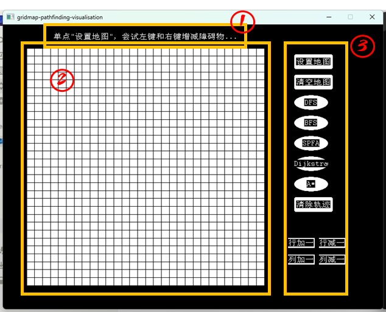
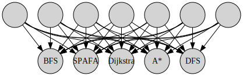
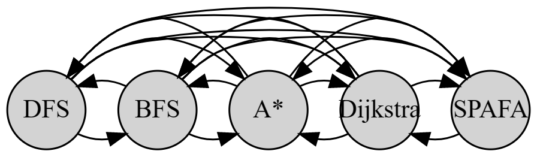

# 项目开发文档

# 可行性分析报告

## 项目的要求

网格地图的建立以及可视化寻路，应具备如表1的功能。 

表1 项目的功能要求

| 功能名称 | 简述 |
| --- | --- |
| 界面初始化 | 通过程序的默认参数构造空白默认地图和可交互栏按钮 |
| 地图设置 | 在地图设置过程中，可以设置地图障碍物的摆放和起点终点的设定 |
| 清空地图 | 清空地图上的所有障碍物 |
| 网格图大小改变 | 可以改变网格地图的行数和列数 |
| 多种寻路算法寻路 | 设置多种寻路算法，如Dijkstra、A*，在地图上寻找从起点到终点的路径，并记录搜索顺序和最终路径结果 |
| 搜索顺序可视化 | 对记录的搜索顺序按顺序绘制，并尽量反应先后顺序 |
| 最终路径的可视化 | 对记录的最终查询到的路径进行可视化展示 |
| 轨迹清除 | 保留地图信息，只对搜索顺序和最终路径的可视化进行清除 |

### 性能与输入输出要求

要求系统运行时稳定、高效、快速响应用户操作；要求操作拦和地图设置的可交互性，能很好的体现当前交互状态和悬停选中等情况；要求能够很好的指引用户进行操作，具有易于操作性；要求对于异常操作或程序运行错误抛出操作提示或异常，便于用户理解和开发者的问题修复。

### 项目的环境、条件、假定和限制

1. 建议软件开发所用时间：1周
2. 软件可运行环境：电脑
3. 系统可运行操作系统：Windows7及以上
4. 软件开发工具：Visual Studiio、VScode
5. 开发项目投入使用的最迟时间：1周后
6. 经济来源：自筹
7. 法律与政策限制：遵守国家法律法规，禁止损害国家权益、威胁国家安全

## 技术可行性分析

采用编程语言为C++，编程范式为面向对象，图形库为easyX。这些均为较为底层的语言与图形库，但由于需求功能简单，故而具有实现的可行性。

## 经济可行性分析

本项目为自建项目，无经济投入与收益投资

## 社会可行性分析

网格图寻路为寻路中的一个重要类别，相比一般的图上寻路，网格图寻路一般限制为能够向上向下向左向右的四个方向进行寻路。其在算法或数据结构的教学中具有重要地位，并在2D游戏上具有广泛的使用，本项目面向学习算法或其他相关方向的初学者，便于用户理解各种寻路算法的步骤、偏好、适用条件，同时具有可拓展性，能很方便的进行教学工作，所以具有社会可行性。

## 用户使用可行性

该平台结构简单，界面简洁，操作方便，适用于广大学习者或教师理解展示使用。

# 项目开发计划

阶段一：需求分析（半天）

- 完成需求分析报告

阶段二：概要设计（半天）

- 确定系统的总体结构和模块划分
- 完成概要设计说明书

阶段三：详细设计（1天）

- 进行模块的具体设计和编写
- 完成详细设计说明书

阶段四：编码与测试（2天）

- 根据详细设计进行编码
- 进行单元测试和综合测试

阶段五：系统测试与验收（半天）

- 进行系统测试和验收，确保系统符合要求

阶段六：文档编写（1天半）

- 编写用户操作手册、测试计划、测试分析报告、项目开发总结报告、软件问题报告等相关文档

总计时长：6天

# 软件需求说明书

## 项目背景

该项目为网格地图的建立以及可视化寻路程序，旨在为算法或其他相关方向的初学者提供一个方便易用的工具，便于用户理解各种寻路算法的步骤、偏好、适用条件。本项目采用编程语言为C++，编程范式为面向对象，图形库为easyX。

## 需求分析

### 功能要求

项目的功能要求如下：

| 功能名称 | 简述 |
| --- | --- |
| 界面初始化 | 通过程序的默认参数构造空白默认地图和可交互栏按钮 |
| 障碍物放置 | 在地图设置过程中，可以通过鼠标按压设置地图障碍物的摆放 |
| 障碍物清除 | 在地图设置过程中，可以通过鼠标按压设置地图障碍物的删除 |
| 设置起点终点 | 在地图设置过程中，可以设置寻路的起点和终点 |
| 清空地图 | 清空地图上的所有障碍物 |
| 行加一 | 更新地图，地图的行数加上一，继承地图信息，对于越界的结点信息做清除，对新的结点初始化 |
| 行减一 | 更新地图，地图的行数减去一，继承地图信息，对于越界的结点信息做清除，对新的结点初始化 |
| 列加一 | 更新地图，地图的列数加上一，继承地图信息，对于越界的结点信息做清除，对新的结点初始化 |
| 列减一 | 更新地图，地图的列数减去一，继承地图信息，对于越界的结点信息做清除，对新的结点初始化 |
| dfs算法寻路 | 用dfs算法在地图上寻找从起点到终点的路径，并记录搜索顺序和最终路径结果 |
| bfs算法寻路 | 用bfs算法在地图上寻找从起点到终点的路径，并记录搜索顺序和最终路径结果 |
| SPAF算法寻路 | 用SPFA算法在地图上寻找从起点到终点的路径，并记录搜索顺序和最终路径结果 |
| Dijkstra算法寻路 | 用Dijkstra算法在地图上寻找从起点到终点的路径，并记录搜索顺序和最终路径结果 |
| A*算法寻路 | 用A*算法在地图上寻找从起点到终点的路径，并记录搜索顺序和最终路径结果 |
| 搜索顺序可视化 | 对记录的搜索顺序按顺序绘制，并尽量反应先后顺序 |
| 最终路径的可视化 | 对记录的最终查询到的路径进行可视化展示 |
| 轨迹清除 | 保留地图信息，只对搜索顺序和最终路径的可视化进行清除 |

### 性能要求

要求系统运行时稳定、高效、快速响应用户操作；要求操作拦和地图设置的可交互性，能很好的体现当前交互状态和悬停选中等情况；要求能够很好的指引用户进行操作，具有易于操作性；要求对于异常操作或程序运行错误抛出操作提示或异常，便于用户理解和开发者的问题修复。

### 环境要求

1. 软件开发所用时间为1周
2. 软件可运行环境：电脑
3. 系统可运行操作系统：Windows7及以上
4. 软件开发工具：Visual Studiio、VScode
5. 开发项目投入使用的最迟时间：1周后

# 概要设计说明书

## 模块层次结构

### 界面初始化模块

- 界面初始化函数

### 交互栏按钮控制模块

- 按钮更新识别函数
- 按钮弹起函数

### 地图设置模块

- 地图设置函数
- 障碍物放置函数
- 障碍物清除函数
- 设置起点终点函数

### 清空地图模块

- 清空地图函数

### 网格图大小改变模块

- 行加一函数
- 行减一函数
- 列加一函数
- 列减一函数

### 寻路模块

- dfs算法寻路函数
- bfs算法寻路函数
- SPAF算法寻路函数
- Dijkstra算法寻路函数
- A*算法寻路函数

### 可视化模块

- 搜索顺序可视化函数
- 最终路径的可视化函数
- 轨迹清除函数

## 调用关系

- 界面初始化模块调用界面初始化函数
- 地图设置模块调用地图设置函数
- 地图设置模块调用障碍物放置函数、障碍物清除函数、设置起点终点函数
- 清空地图模块调用清空地图函数
- 网格图大小改变模块调用行加一函数、行减一函数、列加一函数、列减一函数
- 寻路模块调用dfs算法寻路函数、bfs算法寻路函数、SPAF算法寻路函数、Dijkstra算法寻路函数、A*算法寻路函数
- 可视化模块调用搜索顺序可视化函数、最终路径的可视化函数、轨迹清除函数

## 模块间接口

- 界面初始化模块和地图设置模块、清空地图模块、网格图大小改变模块、寻路模块、可视化模块通过调用函数进行接口交互

## 人机界面

- 通过界面初始化模块实现交互栏按钮的构造
- 通过地图设置模块实现地图上障碍物的摆放、起点终点的设定
- 通过清空地图模块实现对地图障碍物的清除
- 通过网格图大小改变模块实现对地图行列数的改变
- 通过寻路模块实现多种寻路算法的实现，并记录搜索顺序和最终路径结果
- 通过可视化模块实现对搜索顺序和最终路径的可视化展示，并进行轨迹清除
- 通过调用函数实现模块间的接口交互，实现系统的总体功能

# 详细设计说明书

## 界面设计

### 界面主体设计



图4-1 程序测试截图

如图4-1所示，界面主要包括三个部分：

1. 操作引导框图部分：在点击不同的按钮后显示操作指导、操作结果、操作提示等，便于提示用户错误操作或指导用户使用系统，所有的提示词在4.2中给出。
2. 网格图可视化与交互部分：这是主要的显示地图操作与可视化的界面部分。白色方格表示为无障碍物的“EMPTY”状态的方格；黑色方格表示有障碍物无法通行的“WALL”状态方格；灰色方格表示“SELECT”的鼠标悬停选中的方格；“S”表示“Start”即地图的起点；“E”表示“End”即地图的终点。
3. 控制栏（交互栏按钮）部分：这是主要的用户操作区域。用户点击按钮可以“按下”按钮，即白色的按钮表示其状态为“STATE_CLOSE”的闲置（没有按下）状态；蓝色的按钮表示其为“STATE_OPEN”的工作（按下）状态；灰色的按钮表示“STATE_SELECT”的鼠标悬停选中的状态。

注意：起点、终点是可以和墙体重叠的。

### 控制栏设计

控制栏主要是对按键的集成，其设置了默认的文本，形状等，并带有默认的按钮间距和位置排列，具体的设计将在4.2给出。


图4-2 控制栏设计与按钮状态示意

按钮的功能排布可见图4-2，其通过按钮形状和按钮间距进行了基本的功能区分，其摆放顺序也基本符合操作顺序。从上到下依次为地图操作部分、算法选择部分、轨迹清除部分和地图大小调整部分。

从左到右依次体现了初始状态、鼠标悬停（选中）状态、按下按钮状态、按下按钮状态时选中另一个按钮状态。

控制栏囊括的功能如下表：

表4-1 所有按钮囊括功能及简述

| 功能名称 | 简述 |
| --- | --- |
| 界面初始化 | 通过程序的默认参数构造空白默认地图和可交互栏按钮 |
| 障碍物放置 | 在地图设置过程中，可以通过鼠标按压设置地图障碍物的摆放 |
| 障碍物清除 | 在地图设置过程中，可以通过鼠标按压设置地图障碍物的删除 |
| 设置起点终点 | 在地图设置过程中，可以设置寻路的起点和终点 |
| 清空地图 | 清空地图上的所有障碍物 |
| 行加一 | 更新地图，地图的行数加上一，继承地图信息，对于越界的结点信息做清除，对新的结点初始化 |
| 行减一 | 更新地图，地图的行数减去一，继承地图信息，对于越界的结点信息做清除，对新的结点初始化 |
| 列加一 | 更新地图，地图的列数加上一，继承地图信息，对于越界的结点信息做清除，对新的结点初始化 |
| 列减一 | 更新地图，地图的列数减去一，继承地图信息，对于越界的结点信息做清除，对新的结点初始化 |
| dfs算法寻路 | 用dfs算法在地图上寻找从起点到终点的路径，并记录搜索顺序和最终路径结果 |
| bfs算法寻路 | 用bfs算法在地图上寻找从起点到终点的路径，并记录搜索顺序和最终路径结果 |
| SPAF算法寻路 | 用SPFA算法在地图上寻找从起点到终点的路径，并记录搜索顺序和最终路径结果 |
| Dijkstra算法寻路 | 用Dijkstra算法在地图上寻找从起点到终点的路径，并记录搜索顺序和最终路径结果 |
| A*算法寻路 | 用A*算法在地图上寻找从起点到终点的路径，并记录搜索顺序和最终路径结果 |
| 搜索顺序可视化 | 对记录的搜索顺序按顺序绘制，并尽量反应先后顺序 |
| 最终路径的可视化 | 对记录的最终查询到的路径进行可视化展示 |
| 轨迹清除 | 保留地图信息，只对搜索顺序和最终路径的可视化进行清除 |

### 轨迹可视化设计


图4-3 程序界面交互示意

通过图4-3可以理解颜色与对应交互状态的含义：如左1所示，“设置地图”按钮为蓝色，表示“设置地图”按钮为按下状态而其他按钮都没有按下，终点“E”所在的格子颜色为灰色表示鼠标悬停（没有按下的）在这个位置；左2所示表示只有“Dijkstra”按钮按下，表示当前正在可视化Dijkstra算法的轨迹，同时地图是锁定的，即无法像图左1一样的选中地图方格和修改方格。按钮内部“开关”和“按键”的性质、按钮与模块接口的关系，以及按钮之间的互斥关系将在4.2中进行叙述。

通过图4-3左2和右1可以理解方格颜色与对应轨迹的联系：如左2和右1所示，部分方格是蓝色-紫色的渐变色，其表示这些网格点是在寻路算法中迭代过的点，而从蓝到紫的渐变表示了迭代搜索的前后顺序，具体来说，越偏向于蓝色的结点在算法中被查询的时间越靠前；越偏向于紫色的结点在算法中被查询的时间越靠后。而绿色的轨迹表示查询到的从起点到终点的路径，除了“dfs”以外这条路径一定是起点到终点的最短路径。五种寻路算法的底层设计原理与各自的性质将在4.2中进行叙述。

### 界面操作流程

1. 通过程序的默认参数构造空白默认地图和可交互栏按钮。
2. 在地图设置过程中，可以通过鼠标按压设置地图障碍物的摆放。
3. 在地图设置过程中，可以通过鼠标按压设置地图障碍物的删除。
4. 在地图设置过程中，可以设置寻路的起点和终点。
5. 清空地图上的所有障碍物。
6. 更新地图，地图的行数加上一，继承地图信息，对于越界的结点信息做清除，对新的结点初始化。
7. 更新地图，地图的行数减去一，继承地图信息，对于越界的结点信息做清除，对新的结点初始化。
8. 更新地图，地图的列数加上一，继承地图信息，对于越界的结点信息做清除，对新的结点初始化。
9. 更新地图，地图的列数减去一，继承地图信息，对于越界的结点信息做清除，对新的结点初始化。
10. 用dfs算法在地图上寻找从起点到终点的路径，并记录搜索顺序和最终路径结果。
11. 用bfs算法在地图上寻找从起点到终点的路径，并记录搜索顺序和最终路径结果。
12. 用SPFA算法在地图上寻找从起点到终点的路径，并记录搜索顺序和最终路径结果。
13. 用Dijkstra算法在地图上寻找从起点到终点的路径，并记录搜索顺序和最终路径结果。
14. 用A*算法在地图上寻找从起点到终点的路径，并记录搜索顺序和最终路径结果。
15. 对记录的搜索顺序按顺序绘制，并尽量反应先后顺序。
16. 对记录的最终查询到的路径进行可视化展示。
17. 保留地图信息，只对搜索顺序和最终路径的可视化进行清除。

### 控制台的显示


大部分对象的创建和函数都会在控制台输出便于用户和开发者理解项目的运行。同时如果发生程序错误，错误信息也会在控制台输出方便开发者检查。

## 模块设计

### **界面模块**

输入：输入为”消息“，即鼠标消息的数据、按键消息的数据

输出：输出的是整个图形化界面，包括了地图信息、控制栏按钮状态和操作引导。

功能：界面模块需要初始化设置界面宽度和高度；需要设置按键名字、位置、大小、形状；需要初始化默认大小为30*30的空白网格图；需要调用接口读取”消息“并维护三个状态分别为：左键是否按下`isLPress`、右键是否按下`isRPress`、是否退出`isExit`;需要更新输出操作引导；需要调用交互栏按钮控制模块接口更新按钮状态；需要根据按键状态调用对应接口如下表。

按键之间的相互排斥关系设计：

1. 地图的改变和清空都会弹起寻路算法按钮



图4-4 按钮互斥逻辑1

2.寻路算法按钮按键之间相互弹起



图4-5 按钮互斥逻辑2

1. 自己弹起自己
    
    .png)
    

图4-6 按钮互斥逻辑3

上图中路径指向的含义是，当某个按键按下，这个按键所指向的其他按键会被弹起。自己指向自己表示按下当前按钮后系统会执行相关功能，进行结束后弹起自身，即按键和开关的区别。

根据按钮顺序从上到下将按钮命名为0到11，按下按钮对应的逻辑功能见下表：

表4-2 按钮对应的逻辑功能

| 设置地图 | 调用地图设置模块更新结点状态接口（输入鼠标消息、键是否按下isLPress、右键是否按下isRPress）；弹起按钮2-6。 |
| --- | --- |
| 清空地图 | 调用地图设置模块重置接口；弹起自己；弹起按钮2-6。 |
| DFS | 检查是否有起点终点；判断是否是按下算法按钮的一瞬间；如果都是，弹起其他算法按钮；初始化算法参数；重绘地图；运行算法；绘制轨迹；绘制路径。 |
| BFS | 检查是否有起点终点；判断是否是按下算法按钮的一瞬间；如果都是，弹起其他算法按钮；初始化算法参数；重绘地图；运行算法；绘制轨迹；绘制路径。 |
| SPAFA | 检查是否有起点终点；判断是否是按下算法按钮的一瞬间；如果都是，弹起其他算法按钮；初始化算法参数；重绘地图；运行算法；绘制轨迹；绘制路径。 |
| Dijkstra | 检查是否有起点终点；判断是否是按下算法按钮的一瞬间；如果都是，弹起其他算法按钮；初始化算法参数；重绘地图；运行算法；绘制轨迹；绘制路径。 |
| A* | 检查是否有起点终点；判断是否是按下算法按钮的一瞬间；如果都是，弹起其他算法按钮；初始化算法参数；重绘地图；运行算法；绘制轨迹；绘制路径。 |
| 清除轨迹 | 重绘地图；弹起自己；弹起按钮2-6。 |
| 行加一 | 调用网格图大小改变模块行加一接口；弹起按钮2-6。 |
| 行减一 | 调用网格图大小改变模块行减一接口；弹起按钮2-6。 |
| 列加一 | 调用网格图大小改变模块列加一接口；弹起按钮2-6。 |
| 列减一 | 调用网格图大小改变模块列减一接口；弹起按钮2-6。 |

逻辑功能对应的提示词如下：

表4-3 操作引导提示词设计表格

| 触发条件 | 操作引导提示词 |
| --- | --- |
| 初始化界面后 | 单点"设置地图"，尝试左键和右键增减障碍物… |
| 按键“设置地图”按下 | 按下键盘"S"或"E"以设置起点终点… |
| 按键“清空地图”按下 | 地图已清空！ |
| 算法按钮后检查到未设置起点或终点 | 请定义起点S和终点E！ |
| 按键“清空地图”按下并路径可视化结束后 | 尝试点击"清除轨迹"或直接点击切换其他算法… |
| 按键”清除轨迹“按下 | 轨迹已清空！ |

### **交互栏按钮控制模块**

1. 插入按钮功能

输入：坐标、大小、显示文本、形状

输出：无

功能：在交互栏插入一个对应设置的可交互按钮，如果没有输入大小、形状、文本会自动排布。

1. 按钮绘制功能

输入：无

输出：无

功能：在可视化界面上对应位置绘制对应大小状态（颜色）的按钮。

1. 获取选中按钮功能

输入：鼠标所在坐标

输出：鼠标所在按钮编号

功能：循环检测鼠标是否在某个按键上，如果在返回按钮编号，如果不在返回-1。

1. 更新按钮状态功能

输入：鼠标所在坐标，鼠标左键是否正在点击

输出：无

功能：更新按钮状态，在可视化界面上对应位置绘制对应大小状态（颜色）的按钮。

1. 获取按钮状态功能

输入：按钮编号

输出：按钮状态

功能：根据输入的按钮编号查询按钮状态

1. 重置按钮状态（弹起）功能

输入：按钮编号

输出：无

根据输入的按钮编号更新按钮状态为抬起，在可视化界面上对应位置绘制对应大小状态（颜色）的按钮。

### **地图设置模块**

1. 获取鼠标所在结点功能

输入：鼠标所在坐标

输出：鼠标所在网格编号

功能：计算鼠标是否在某个网格上，如果在返回按钮编号，如果不在返回-1。

注意：因为网格图的性质可以直接通过位置信息计算出鼠标所指向的网格点编号而可以大大的提高系统性能。

1. 更新结点类型功能

输入：鼠标所在坐标，鼠标左键是否正在点击

输出：无

功能：更新网格状态，在可视化界面上对应位置绘制对应大小状态（颜色）的按钮。

1. 清空地图功能

输入：无

输出：无

功能：遍历每个结点改变状态为空，设置起点终点为空，重新绘制地图。

### **地图显示模块**

1. 绘制地图：全局刷新显示

输入：无

输出：无

功能：遍历每个结点绘制对应状态颜色的结点，绘制起点终点。

1. 绘制地图：部分点的局部刷新

输入：点集向量

输出：无

功能：遍历点集每个结点绘制对应状态颜色的结点，如果有起点终点绘制起点终点。

注意：使用局部刷新的绘制地图会大大提高系统性能。

### **网格图大小改变模块**

1. 增加行

输入：无

输出：无

功能：更改地图的行的数量加一，调整网格的高度，继承之间地图的结点信息。

1. 减少行

输入：无

输出：无

功能：如果行数大于一，更改地图的行的数量减一，调整网格的高度，继承之间地图的结点信息，越界的结点信息会被删除。

1. 增加列

输入：无

输出：无

功能：更改地图的列的数量加一，调整网格的宽度，继承之间地图的结点信息。

1. 减少列

输入：无

输出：无

功能：如果列数大于一，更改地图的列的数量加一，调整网格的宽度，继承之间地图的结点信息，越界的结点信息会被删除。

### **寻路模块和可视化模块**

1. 寻路算法参数初始化

输入：无

输出：无

功能：初始化参数

1. 约束条件函数

输入：横纵坐标

输出：是否满足约束

功能：判断坐标是否越界，判断坐标是否为障碍物。

1. 目标状态判断函数

输入：横纵坐标

输出：是否到达终点

功能：判断坐标是否在终点

1. 启发函数

输入：横纵坐标

输出：预测值

功能：计算曼哈顿距离作为启发函数值

1. 算法函数

输入：无

输出：无

功能：根据起点终点，地图信息，进行搜索，存储范围结点的先后搜索序以及最终路径。

1. 绘制搜索序轨迹

输入：无

输出：无

功能：根据结点的先后搜索序绘制搜索序轨迹。

1. 绘制最终路径

输入：无

输出：无

功能：根据最终路径绘制最终路径。

## 类对模块的封装和实现

根据模块之间的调用关系以及他们的所属联系，我们将模块封装为以下类。

一些枚举类：

> enum shape { SHAPE_RECT, SHAPE_ROUN, SHAPE_CIRC }; // 矩形、圆角矩形、椭圆
enum statu { STATE_OPEN , STATE_CLOSE, STATE_SELECT}; // 按下、闲置、悬浮
enum NodeType {EMPTY, WALL ,SELECT};// 空 墙 选
> 

一些参数：

> //可调参数
const int N = 30; // 地图默认行数
const int M = 30; // 地图默认列数
const int WIDTH = 800; // 窗口宽度
const int HEIGHT = 600; // 窗口高度
const int MAP_X = 50; // 地图左上角坐标
const int MAP_Y = 50; // 地图左上角坐标
const int MAP_WIDTH = 500; // 地图宽度
const int MAP_HEIGHT = 500; // 地图高度
const int BAR_X = 600; // 控制栏左上角坐标
const int BAR_Y = 50; // 控制栏左上角坐标
const int BAR_WIDTH = 200; // 控制栏宽度
const int BAR_HEIGHT = 500; // 控制栏高度
> 

一些全局变量：

> const int maxn = 10000 + 10;
> 
> 
> int backwardIndexing[maxn]; // 反向索引
> std::vector<int> accessTracks; // 访问轨迹
> int dist[maxn]; // 距离数组
> int vis[maxn]; // 访问数组
> 

### Button：按钮类

```cpp
class Button
{
	int id;
	std::string text;
	int x, y, width, height;
	shape type;
	statu state;
public:
	Button(int id, std::string text, int x, int y, int width, int height, shape type);
	void draw(int dx,int dy);
	statu GetStatu();
	void reset();
};
```

一个名为`Button`的类，它表示一个按钮，具有按钮的基本属性和状态，例如文本、位置、大小、形状和状态等。以下是这个类的具体实现方式的细节：

- **数据结构和算法**

`Button`类中的数据结构主要包括整数类型的`id`、`x`、`y`、`width`、`height`等，字符串类型的`text`，枚举类型的`shape`和`statu`。其中`shape`表示按钮的形状类型，`statu`表示按钮的状态类型。这些数据成员都是私有的，但是`ControlBar`类是`Button`类的友元类，在`ControlBar`类中可以访问`Button`类的私有数据成员。

`Button`类的算法主要是`draw()`函数，它使用了Windows API的绘图函数来画按钮的形状，并根据按钮的状态选择不同的颜色进行填充。`draw()`函数还使用了Windows API的文字绘制函数将按钮文本绘制在按钮中心位置。

- **代码实现**

`Button`类的构造函数`Button(int id, std::string text, int x, int y, int width, int height, shape type = SHAPE_ROUN)`用于初始化类的私有数据成员。`draw()`函数用于绘制按钮，并根据按钮状态选择不同的颜色进行填充。`GetStatu()`函数用于返回按钮的当前状态。`reset()`函数用于将按钮状态重置为关闭状态。

- **模块测试计划**

为了测试`Button`类，可以编写一个简单的测试程序，创建一个按钮对象并调用它的方法，例如绘制按钮，获取按钮状态等。可以使用`assert()`函数来验证按钮的状态是否正确。

- **优化模块性能**

为了优化`Button`类的性能，可以考虑以下几个方面：

1. 缓存按钮的状态和绘图结果，减少绘图函数的调用，提高绘图速度。
2. 使用更高效的绘图函数，例如使用OpenGL或DirectX等图形库来绘制按钮。
3. 优化绘图算法，例如使用GPU加速，减少绘图时间。

### ControlBar：控制栏类

```cpp
class ControlBar
{
	std::vector<Button> buttons;
	int cnt;
	int x, y, width, height;
	int LILENGTH;
public:
	ControlBar(int x, int y, int width, int height, int LILENGTH);
	void insert(int x, int y, int width, int height, std::string text, shape type);
	void insert(int width, int height, std::string text, shape type); // 插入按钮功能
	void draw(); // 按钮绘制功能
	int GetSelectButton(int mx,int my);  // 获取选中按钮
	void UpdateStatus(int mx, int my, bool isLDown); // 更新按钮状态
	statu GetStatus(int i); // 获取按钮状态
	void reset(int i); // 重置按钮状态
};
```

这是一个名为`ControlBar`的类，它表示一个控制栏，包含多个按钮。以下是这个类的具体实现方式的细节：

- **数据结构和算法**

`ControlBar`类中的数据结构主要包括一个存储按钮的`vector`，整数类型的`cnt`、`x`、`y`、`width`、`height`和`LILENGTH`。其中`cnt`表示按钮的数量，`x`、`y`、`width`和`height`表示控制栏的位置和大小，`LILENGTH`表示按钮之间的间距。这些数据成员都是私有的。

`ControlBar`类的算法主要是`draw()`、`GetSelectButton()`和`UpdateStatus()`函数。`draw()`函数使用了Windows API的缓冲绘图函数将所有按钮绘制出来。`GetSelectButton()`函数用于获取鼠标当前位置下被选中的按钮的ID。`UpdateStatus()`函数用于更新按钮的状态，根据鼠标的位置和状态实现按钮状态的变化。

- **代码实现**

`ControlBar`类的构造函数`ControlBar(int x, int y, int width, int height, int LILENGTH = 10)`用于初始化类的私有数据成员。`insert()`函数用于插入一个新的按钮到控制栏中。`draw()`函数用于绘制控制栏的所有按钮。`GetSelectButton()`函数用于获取鼠标当前位置下被选中的按钮的ID。`UpdateStatus()`函数用于更新按钮的状态。`GetStatus()`函数用于获取指定按钮的状态。`reset()`函数用于将指定按钮的状态重置为关闭状态。

- **模块测试计划**

为了测试`ControlBar`类，可以编写一个简单的测试程序，创建一个控制栏对象并调用它的各个方法，例如插入按钮、绘制控制栏、获取选中按钮、更新按钮状态等。可以使用`assert()`函数来验证按钮的状态是否正确。

- **优化模块性能**

为了优化`ControlBar`类的性能，可以考虑以下几个方面：

1. 使用高效的数据结构来存储按钮，例如使用哈希表、红黑树等数据结构来快速查找和插入按钮。
2. 使用多线程来绘制控制栏，提高绘图速度。
3. 将按钮的状态更新操作延迟到下一次绘图时再执行，避免频繁的状态更新导致的性能问题。

### Point：点基类

```cpp
class Point {
private:
    int id_;
public:
    Point();
    Point(int id);
    virtual ~Point();
    int GetID() const;
};
```

这是一个名为`Point`的类，它表示一个点，具有一个ID属性。以下是这个类的具体实现方式的细节：

- **数据结构和算法**

`Point`类中的数据结构主要包括一个整数类型的`id_`。这个数据成员是私有的，表示点的ID属性。`Point`类没有其他的算法或方法。

- **代码实现**

`Point`类的构造函数`Point()`和`Point(int id)`用于初始化类的私有数据成员`id_`。`GetID()`函数用于返回点的ID属性。

- **模块测试计划**

为了测试`Point`类，可以编写一个简单的测试程序，创建一个点对象并调用它的方法，例如获取点的ID属性。可以使用`assert()`函数来验证点的ID属性是否正确。

- **优化模块性能**

由于`Point`类没有实现任何算法和方法，因此无法对它进行性能优化。

### Path：单向路径类

```cpp
class Path {
private:
    Node* to_;
    Path* next_;
    int val_;
public:
    Path(Node* to, Path* next = nullptr, int val);
    ~Path();
    Path* Next() const;
    int Val() const;
    Node* GoTo() const;
};
```

这是一个名为`Path`的类，它表示图中的一条边，包含指向另一个节点的指针、下一条边的指针和边的权值。以下是这个类的具体实现方式的细节：

- **数据结构和算法**

`Path`类中的数据结构主要包括一个指向另一个节点的指针`to_`、下一条边的指针`next_`和整数类型的边权值`val_`。其中`to_`和`next_`都是指针类型，`val_`是一个整数类型。这些数据成员都是私有的。

`Path`类的算法主要是构造函数和析构函数。构造函数用于初始化类的私有数据成员，析构函数用于释放类的资源。

- **代码实现**

`Path`类的构造函数`Path(Node* to, Path* next = nullptr, int val = 1)`用于初始化类的私有数据成员`to_`、`next_`和`val_`。其中`to_`表示指向另一个节点的指针，`next_`表示下一条边的指针，`val_`表示边的权值。如果边的权值小于0，构造函数会打印一个警告信息。构造函数还会打印一条信息表示创建了一条边。

`Path`类的析构函数`~Path()`用于释放类的资源，打印一条信息表示删除了一条边。

`Next()`函数用于返回下一条边的指针，`Val()`函数用于返回边的权值，`GoTo()`函数用于返回指向另一个节点的指针。

- **模块测试计划**

为了测试`Path`类，可以编写一个简单的测试程序，创建一些边对象并调用它们的方法，例如获取边的权值、获取指向另一个节点的指针、获取下一条边的指针等。可以使用`assert()`函数来验证边的属性是否正确。

- **优化模块性能**

由于`Path`类的实现比较简单，且没有明显的性能瓶颈，因此无法对它进行性能优化。

### Node：网格结点类

```cpp
class Node : public Point {
private:
    Path* edge_head_; // head of edge list
public:  
    NodeType type;
    class Iterator {
    private:
        Path* current_;
    public:
        Iterator(Path* path);
        bool operator!=(const Iterator& other) const;
        Iterator& operator++();
        Path& operator*() const;
    };
    Iterator begin();
    Iterator end();
    Node();
    Node(int id);
    Node(int id, Node e);
    ~Node();
    void AddEdge(Node* to, int val);
    void PrintEdge();
};
```

这是一个名为`Node`的类，它表示图中的一个节点，包含一个指向边链表头部的指针和一个节点类型。同时，`Node`类继承了`Point`类，具有一个ID属性。以下是这个类的具体实现方式的细节：

- **数据结构和算法**

`Node`类中的数据结构主要包括一个指向边链表头部的指针`edge_head_`和一个`NodeType`类型的节点类型`type`。其中`edge_head_`是指针类型，`type`是一个枚举类型。这些数据成员都是私有的。

`Node`类的算法主要是构造函数和析构函数，以及`AddEdge()`和`PrintEdge()`函数。构造函数用于初始化类的私有数据成员，析构函数用于释放类的资源。`AddEdge()`函数用于添加一条边到节点的边链表中，`PrintEdge()`函数用于打印所有与该节点相连的边。

`Node`类还定义了一个名为`Iterator`的内部类，用于迭代节点的边链表。`Iterator`类包含一个指向当前边的指针`current_`，实现了`!=`、`++`和`*`运算符，用于判断是否到达链表末尾、遍历链表和返回当前边的引用。

`Node`类还实现了`begin()`和`end()`函数，用于返回迭代器的起始和结束位置，以支持C++11的范围循环语法。

- **代码实现**

`Node`类的构造函数`Node()`、`Node(int id)`和`Node(int id, Node e)`用于初始化类的私有数据成员`edge_head_`和`type`，以及继承自`Point`类的`id_`属性。其中`id_`由`Point`类的构造函数初始化。构造函数还会打印一条信息表示创建了一个节点。

`Node`类的析构函数`~Node()`用于释放类的资源，包括释放所有边的内存。析构函数还会打印一条信息表示删除了一个节点。

`AddEdge()`函数用于添加一条边到节点的边链表中。如果链表为空，则将新边插入为链表头部；否则将新边插入到链表头部。函数还会打印一条信息表示添加了一条边。

`PrintEdge()`函数用于打印所有与该节点相连的边。函数使用C++11的范围循环语法遍历边链表，并打印每条边的信息。函数还会打印一条信息表示打印完毕。

`begin()`和`end()`函数用于返回迭代器的起始和结束位置。`begin()`函数返回一个指向链表头部的迭代器，`end()`函数返回一个指向空指针的迭代器。

- **模块测试计划**

为了测试`Node`类，可以编写一个简单的测试程序，创建一些节点对象并调用它们的方法，例如添加边、打印与该节点相连的边等。可以使用`assert()`函数来验证节点的属性是否正确。

- **优化模块性能**

为了优化`Node`类的性能，可以考虑以下几个方面：

1. 使用高效的数据结构来存储边链表，例如使用哈希表、红黑树等数据结构来快速查找和插入边。
2. 使用多线程来构建节点和添加边，提高节点构建和边添加的速度。
3. 将边的权值存储在另一个数据结构中，避免在边链表中存储边的权值，以节省空间。

### GridMap：网格地图类

```cpp
class GridMap {
private:
    int x, y, width, height;
    double iWidth, iHeight;
    int n_, m_;
    std::vector<Node> ref_p_;
    Node *start_, *end_;
protected:
    int GetMark(int x, int y) const ;
    void ReMark(int& x, int& y, int id) ;
    void BuildEdge(Node& u, Node& v, int w) ;
    void BuildEdge(GridMap& R, int p1, int p2, int w);
    void BuildEdge(GridMap& R, int x1, int y1, int x2, int y2, int w);
public:
    void ReSize(int n, int m); // 重置地图大小
    void AddN(); // 增加行
    void LesN(); // 减少行
    void AddM(); // 增加列
    void LesM(); // 减少列
    bool nullcheck();
    GridMap(int n, int m, int x, int y, int width, int height);
    ~GridMap();
    Node& AskRef(int p);
    Node& AskRef(int x, int y);
    void draw(); // 绘制地图
    void draw(std::queue<int> &q);
    void reset();// 重置地图
    int GetSelectNode(int mx, int my) ;
    void UpdateNodeType(int mx, int my, bool isLDown, bool isLPress,bool isRDown, bool isRPress, bool isSRress, bool isERress);// 更新结点类型
    // 寻路算法部分
    void init();
    bool constraint_function(int x, int y);
    bool is_goal_state(int x, int y);
    int heuristic_function(int x, int y);
    const int dx[4] = { 0, 0, 1, -1 }, dy[4] = { 1, -1, 0, 0 };
    int dfs_flag;
    void dfs(int x, int y);       
    void dfs();
    void bfs();
    void SPFA();
    void Dijsktra();
    void Astar();
    void DrawMarkNode(int p, COLORREF col);
    COLORREF GetColor(double q);
    void DrawPath();
    void DrawAccess();
};
```

这是一个名为 `GridMap` 的 C++ 类，用于实现二维网格地图的绘制、编辑和搜索。以下是该类的具体实现方式的解释：

**数据结构**

- `Node`：表示二维网格地图中的一个结点，包含结点 ID、坐标、类型（空、障碍、起点、终点）以及与其相邻的结点列表。用于实现地图的编辑和搜索。
- `GridMap`：表示整个二维网格地图，包含地图大小、起点、终点和结点列表。用于实现地图的绘制、编辑和搜索。

**算法**

- 约束条件函数：判断某个结点是否为障碍或越界。
- 目标状态判断函数：判断某个结点是否为终点。
- 启发函数：计算某个结点到终点的曼哈顿距离。
- DFS、BFS、Dijkstra、SPFA、A* 等搜索算法。

**代码实现**

- `GridMap` 类的成员函数包括：`ReSize`（重置地图大小）、`AddN`（增加行）、`LesN`（减少行）、`AddM`（增加列）、`LesM`（减少列）、`nullcheck`（检查起点和终点是否为空）、`AskRef`（获取结点）、`draw`（绘制地图）、`reset`（重置地图）、`GetSelectNode`（获取鼠标所在结点）、`UpdateNodeType`（更新结点类型）、`init`（初始化参数）、`constraint_function`（约束条件函数）、`is_goal_state`（目标状态判断函数）、`heuristic_function`（启发函数）、`dfs`（深度优先搜索）、`bfs`（广度优先搜索）、`Dijsktra`（Dijkstra 算法）、`SPFA`（SPFA 算法）、`Astar`（A* 算法）、`DrawMarkNode`（绘制标记结点）、`GetColor`（获取颜色）和`DrawPath`（绘制搜索序轨迹）等函数。
- 在 `GetSelectNode` 函数中，根据鼠标所在位置计算出对应的结点 ID。
- 在 `UpdateNodeType` 函数中，根据鼠标事件的类型和当前选中的结点类型，更新结点类型。
- 在各个搜索算法中，利用约束条件函数、目标状态判断函数和启发函数等，进行搜索。
- 在 `DrawMarkNode` 函数中，根据颜色和结点 ID，绘制标记结点。
- 在 `GetColor` 函数中，根据搜索序列中某个结点的访问顺序，计算出对应的颜色。
- 在 `DrawPath` 函数中，绘制搜索序轨迹和最终路径。

 **模块测试计划**

- 可以分别测试每个成员函数的功能是否正确，比如：`ReSize`（重置地图大小）、`AddN`（增加行）、`LesN`（减少行）、`AddM`（增加列）、`LesM`（减少列）、`nullcheck`（检查起点和终点是否为空）、`AskRef`（获取结点）、`draw`（绘制地图）、`reset`（重置地图）、`GetSelectNode`（获取鼠标所在结点）、`UpdateNodeType`（更新结点类型）、`init`（初始化参数）、`constraint_function`（约束条件函数）、`is_goal_state`（目标状态判断函数）、`heuristic_function`（启发函数）、`dfs`（深度优先搜索）、`bfs`（广度优先搜索）、`Dijsktra`（Dijkstra 算法）、`SPFA`（SPFA 算法）、`Astar`（A* 算法）、`DrawMarkNode`（绘制标记结点）、`GetColor`（获取颜色）和`DrawPath`（绘制搜索序轨迹）等函数。
- 对于搜索算法，可以分别测试它们在不同场景下的表现，比如：随机生成一个地图并设置起点和终点，进行搜索，观察搜索所用时间、路径长度等指标，并与其他算法进行比较。
- 可以针对特定的应用场景进行测试，比如：在机器人路径规划中，测试算法在不同障碍物密度、地形复杂度等情况下的表现。
- 对于绘制功能，可以测试绘制的地图是否符合预期，并且可以测试在不同的交互模式下（比如：绘制、编辑、搜索）是否能够正常工作。
- 对于标记结点和搜索序轨迹的绘制，可以测试它们是否正确地标记了对应的结点和路径，并且可以测试在不同的搜索算法和场景下是否能够正常工作。
- 可以编写单元测试和集成测试，测试不同函数之间的协作是否正确，并且可以测试代码的健壮性和可靠性。

### 主函数的实现逻辑

主函数实现了一个带路径搜索和操作控制的网格地图界面,主要分为以下几个部分：

初始化窗口：首先调用 `initgraph` 函数初始化窗口，并且定义了一个 ControlBar 类型的 bar 对象，用于定义和绘制控制栏。

绘制地图：调用 GridMap 类的 draw() 函数来绘制整个地图，并且设置相关回调函数，用于实现鼠标左右键的绘制及擦除。

处理用户输入：通过 while 循环不断接收用户输入，包括鼠标移动、鼠标点击、按键等事件。

根据不同的用户事件进行相应操作：对于不同的用户事件，如控制栏按键的点击、鼠标左右键的点击等，程序会在 ControlBar 和 GridMap 类中调用相应的函数进行处理。例如点击“清空地图”按钮时，将调用 GridMap 类的 reset() 函数来清空地图中所有结点。

- **具体实现如下**
1. 初始化绘图库
2. 创建控制栏对象bar
3. 向bar添加13个按键
4. 创建地图对象G
5. 输出操作引导提示词
6. 进入消息循环，不断获取键盘和鼠标消息
    1. 更新按钮状态
    2. 如果按键0“设置地图”被按下
        1. 更新结点状态
        2. 输出操作引导提示词
        3. 尝试重置算法按钮状态
    3. 如果按键1“清空地图”被按下
        1. 清空地图
        2. 重置按钮状态
        3. 输出操作引导提示词
        4. 尝试重置算法按钮状态
    4. 遍历算法按钮
        1. 如果当前算法按钮已被按下且没有起点或终点，则输出错误提示词，重置该按钮状态
        2. 如果当前算法按钮被按下且之前没有被按下过
            1. 弹起其他算法按钮
            2. 根据当前算法按钮进行对应操作
            3. 初始化算法参数
            4. 重绘地图
            5. 执行路径搜索算法
            6. 绘制路径和可到达的区域
            7. 输出操作引导提示词
        3. 如果当前算法按钮未被按下且之前被按下过，则将该按钮状态重置
    5. 如果“清除轨迹”被按下
        1. 重绘地图
        2. 重置按钮状态
        3. 输出操作引导提示词
        4. 尝试重置算法按钮状态
    6. 如果“行加一”被按下，增加行数
    7. 如果“行减一”被按下，减少行数
    8. 如果“列加一”被按下，增加列数
    9. 如果“列减一”被按下，减少列数
    10. 如果按键消息是ESC键，则退出程序
    11. 如果鼠标消息是左键按下
        1. 记录左键已按下
    12. 如果鼠标消息是左键拖动
    13. 如果鼠标消息是左键松开
        1. 记录左键已松开
    14. 在鼠标位置绘制小方块
    15. 如果鼠标消息是右键按下
        1. 记录右键已按下
    16. 如果鼠标消息是右键拖动
    17. 如果鼠标消息是右键松开
        1. 记录右键已松开
7. 退出绘图库
- **测试计划**
1. 检查控制栏中各按钮是否正常响应和变化。
2. 选择不同的起点终点并调用各搜索算法,检查结果是否正确。
3. 重复选择相同的起点终点并调用搜索算法,检查搜索路径是否被覆盖。
4. 调整地图大小和添加障碍物,检查搜索结果是否正确更新。
5. 重复测试以检查程序稳定性。
- **性能优化思路**
1. 采用双缓冲技术优化绘制操作,减少闪烁。
2. 搜索算法函数可采用多线程实现,提高效率。
3. 缓存重复搜索的结果,避免重复运算。
4. 控制栏按钮响应函数可调用bookshelf或者其他GUI库代替,简化代码。
5. 其他标准的优化手段,如内联函数等。

## 关键算法或技术

### 关键技术

项目涉及到的类中，涵盖了很多关键技术，以下是我认为比较重要的几点：

1. 地图数据结构：在GridMap类中，通过二维数组或者向量等数据结构存储地图信息，同时还使用了图形学的技术来实现地图的可视化展示。这个数据结构是整个系统的基础，需要高效地支持寻路算法，同时也需要便于操作和修改。
2. 寻路算法：在GridMap类中，实现了五种不同的寻路算法，分别是DFS、BFS、SPFA、Dijkstra和A*算法。这些算法都是经典的搜索算法，需要考虑如何表示状态和边，如何判断是否到达目标状态，如何处理搜索过程中的状态转移和剪枝等问题。每种算法的实现方式和优缺点也不同，需要根据具体情况来选择合适的算法。
3. 按钮和控制栏：在Button和ControlBar类中，实现了按钮的插入、绘制和状态更新等功能，同时还实现了控制栏的整体布局和交互操作等功能。这些可视化的组件可以提高用户的交互体验，使系统更加直观易用。
4. 图论算法：在Node和Path类中，实现了图论算法中的基本数据结构，如节点、边和邻接表等。这些数据结构是实现寻路算法的基础，同时也可以支持其他图论算法的实现。
5. 启发式函数：在A*算法中，需要使用启发式函数来评估当前状态和目标状态之间的距离，以便更加高效地搜索最优解。这个函数的设计需要结合具体问题来进行优化，可以大大影响算法的性能。

在实现这些关键技术时，需要考虑不同技术之间的协作和优化，同时也需要针对具体问题进行优化和调整。例如，在寻路算法中，可以使用剪枝来减少搜索空间，使用双向搜索来提高搜索效率；在地图数据结构中，可以使用稀疏矩阵等技术来减少存储空间和加速搜索等。因此，在整个系统设计过程中，需要不断进行优化和调整，以便实现更加高效和可靠的系统。

### 关键算法

在给定的代码片段中，实现了几种关键的图搜索算法，用于解决基于网格的路径规划问题。这些算法包括深度优先搜索（DFS）、广度优先搜索（BFS）、最短路径快速算法（SPFA）、Dijkstra算法和A*算法。代码还提供了一个`DrawMarkNode`函数，用于在网格上可视化路径。

1. **深度优先搜索（DFS）**：
DFS是一种遍历图的算法，它从源节点开始，尽可能地沿着每个分支向下遍历，直到无法继续为止。代码中使用递归函数`dfs(int x, int y)`实现了DFS。DFS对路径规划来说并不是最优的算法，因为它可能会在发现最短路径之前探索不必要的分支。
2. **广度优先搜索（BFS）**：
BFS是另一种遍历图的算法，它在移动到下一层之前访问所有同一层的顶点。代码使用队列实现了`bfs()`函数。BFS对于无权图来说是最优的算法，因为它并行地探索所有可能的路径，并找到到达目标的最短路径。
3. **最短路径快速算法（SPFA）**：
SPFA是改进的Bellman-Ford算法，用于在加权图中寻找最短路径。它使用队列来维护活动顶点并更有效地更新它们的距离。`SPFA()`函数实现了这个算法。在平均情况下，SPFA比Bellman-Ford算法更快，但在最坏情况下可能会更慢。
4. **Dijkstra算法**：
Dijkstra算法是一种著名的算法，用于在带有非负边权值的加权图中找到最短路径。代码使用优先队列实现了`Dijkstra()`函数。Dijkstra算法高效且最优，但它不考虑启发式方法，这在某些情况下可以加速搜索。
5. **A*算法**：
A*算法是一种流行的路径规划算法，结合了Dijkstra算法和启发式方法的优点。代码使用优先队列实现了`Astar()`函数。A*算法是高效且最优的，因为它使用启发式函数指导搜索向目标方向前进，并剪枝搜索空间。

# 用户操作手册

## 修订记录

| 版本号 | 修订人 | 修改内容 | 修订日期 |
| --- | --- | --- | --- |
| v1.0.0 | 王梓翕 | 增加了地图大小动态调整功能 | 2023/06/01 |

## 系统概述

### 项目目标

本项目旨在为算法或其他相关方向的初学者提供一个方便易用的工具，便于用户理解各种寻路算法的步骤、偏好、适用条件。

### 项目背景

本项目为网格地图的建立以及可视化寻路程序。

### 应用流程

1. 通过程序的默认参数构造空白默认地图和可交互栏按钮。
2. 在地图设置过程中，可以通过鼠标按压设置地图障碍物的摆放。
3. 在地图设置过程中，可以通过鼠标按压设置地图障碍物的删除。
4. 在地图设置过程中，可以设置寻路的起点和终点。
5. 清空地图上的所有障碍物。
6. 更新地图，地图的行数加上一，继承地图信息，对于越界的结点信息做清除，对新的结点初始化。
7. 更新地图，地图的行数减去一，继承地图信息，对于越界的结点信息做清除，对新的结点初始化。
8. 更新地图，地图的列数加上一，继承地图信息，对于越界的结点信息做清除，对新的结点初始化。
9. 更新地图，地图的列数减去一，继承地图信息，对于越界的结点信息做清除，对新的结点初始化。
10. 用dfs算法在地图上寻找从起点到终点的路径，并记录搜索顺序和最终路径结果。
11. 用bfs算法在地图上寻找从起点到终点的路径，并记录搜索顺序和最终路径结果。
12. 用SPFA算法在地图上寻找从起点到终点的路径，并记录搜索顺序和最终路径结果。
13. 用Dijkstra算法在地图上寻找从起点到终点的路径，并记录搜索顺序和最终路径结果。
14. 用A*算法在地图上寻找从起点到终点的路径，并记录搜索顺序和最终路径结果。
15. 对记录的搜索顺序按顺序绘制，并尽量反应先后顺序。
16. 对记录的最终查询到的路径进行可视化展示。
17. 保留地图信息，只对搜索顺序和最终路径的可视化进行清除。

## 功能说明

### 模块划分

本系统主要由以下模块构成：

- 界面模块
- 控制栏模块
- 网格地图模块
- 寻路算法模块
- 可视化模块

### 应用角色

本系统适用于以下角色：

- 算法或其他相关方向的初学者
- 程序设计教学者

### 使用场景

本系统适用于以下场景：

- 学习算法或其他相关方向的初学者
- 展示寻路算法的步骤、偏好、适用条件

### 步骤说明

使用本系统的步骤如下：

1. 打开程序
2. 设置地图大小
    1. 行加一。左键单击“行加一”。
    2. 行减一。左键单点“行减一”。
    3. 列加一。左键单点“列加一”。
    4. 列减一。左键单点“列减一”。
3. 设置网格地图
    1. 单击“设置地图”，以选中。
    2. 障碍物放置。点击或拖动鼠标左键实现。
    3. 障碍物删除。点击或拖动鼠标右键实现。
    4. 设置起点。鼠标悬停在目标方格上，在键盘上按下“Ｓ”。
    5. 设置终点。鼠标悬停在目标方格上，在键盘上按下“E”。
    6. 单机“设置地图”，关闭选中。
4. 清空地图。若对绘制的地图不满意可以单点“清空地图”清空所有信息，如何可以从新设置地图。
5. 可视化寻路。注：进行寻路前会自动清除已有轨迹。
    1. dfs算法寻路可视化。点击“dfs”。
    2. bfs算法寻路可视化。点击“bfs”。
    3. SPAF算法寻路可视化。点击“SPFA”。
    4. Dijkstra算法寻路可视化。点击“Dijkstra”。
    5. A*算法寻路可视化。点击“A*”。
6. 轨迹清除。点击“清除轨迹”手动清除地图上的轨迹可视化结果。

### 内容说明

本系统主要包括以下内容：

- 地图绘制及操作
- 寻路算法的实现
- 寻路算法的可视化展示

### 系统截图

无

### 注意事项

- 本系统仅供学习交流使用，不得用于商业用途
- 本系统仅适用于算法或其他相关方向的初学者
- 如有问题或建议，欢迎在反馈中提出

# 测试计划

## 测试范围

测试将覆盖以下功能：

- 界面初始化
- 地图设置
- 清空地图
- 网格图大小改变
- 多种寻路算法寻路
- 搜索顺序可视化
- 最终路径的可视化
- 轨迹清除

## 测试方法

测试将采用黑盒测试方法，测试人员将对软件进行以下测试：

- 功能测试：测试所有功能是否能正常使用
- 兼容性测试：测试软件是否能在不同操作系统和不同硬件环境下正常运行
- 压力测试：测试软件在大规模地图和高并发情况下的稳定性

## 测试环境

- 操作系统：Windows 11
- GCC版本：8.5
- 分辨率：1920x1080

## 测试计划

### 第一轮测试

测试目标：

- 界面初始化
- 地图设置
- 清空地图
- 网格图大小改变

测试内容：

1. 打开软件，检查是否可以正常显示界面
2. 在地图上放置障碍物和起点终点，检查是否可以正常设置
3. 清空地图，检查是否可以正常清空地图
4. 改变网格图大小，检查是否可以正常改变大小

### 第二轮测试

测试目标：

- 多种寻路算法寻路
- 搜索顺序可视化
- 最终路径的可视化
- 轨迹清除

测试内容：

1. 在地图上运行多种寻路算法，检查是否可以正常寻路
2. 对搜索顺序进行可视化展示，检查是否可以正常展示
3. 对最终路径进行可视化展示，检查是否可以正常展示
4. 清除轨迹，检查是否可以正常清除

### 压力测试

测试目标：

- 测试软件在大规模地图和高并发情况下的稳定性

测试内容：

1. 在大规模地图上进行寻路
2. 在高并发情况下进行寻路

## 风险评估

- 界面初始化可能出现闪退
- 地图设置可能出现设置错误
- 清空地图可能出现清空不完全
- 网格图大小改变可能出现界面显示异常
- 多种寻路算法寻路可能出现寻路失败
- 搜索顺序可视化可能出现显示不完全
- 最终路径的可视化可能出现显示不完全
- 轨迹清除可能出现清除不完全

## 测试报告

测试报告将包含以下内容：

- 测试范围
- 测试方法
- 测试环境
- 测试计划
- 测试结果
- 风险评估
- 测试结论

# 测试报告

## 测试范围

测试将覆盖以下功能：

- 界面初始化
- 地图设置
- 清空地图
- 网格图大小改变
- 多种寻路算法寻路
- 搜索顺序可视化
- 最终路径的可视化
- 轨迹清除

## 测试方法

测试将采用黑盒测试方法，测试人员将对软件进行以下测

- 功能测试：测试所有功能是否能正常使用
- 兼容性测试：测试软件是否能在不同操作系统和不同硬件环境下正常运行
- 压力测试：测试软件在大规模地图和高并发情况下的稳定性

## 测试环境

- 操作系统：Windows 11
- GCC版本：8.5
- 分辨率：1920x1080

## 测试结果

经过测试，软件能够正常运行，所有功能均能够正常使用，测试结果如下：

### 第一轮测试

测试目标：

- 界面初始化
- 地图设置
- 清空地图
- 网格图大小改变

测试内容：

1. 打开软件，检查是否可以正常显示界面
2. 在地图上放置障碍物和起点终点，检查是否可以正常设置
3. 清空地图，检查是否可以正常清空地图
4. 改变网格图大小，检查是否可以正常改变大小

测试结果：所有测试内容均能够正常通过。

### 第二轮测试

测试目标：

- 多种寻路算法寻路
- 搜索顺序可视化
- 最终路径的可视化
- 轨迹清除

测试内容：

1. 在地图上运行多种寻路算法，检查是否可以正常寻路
2. 对搜索顺序进行可视化展示，检查是否可以正常展示
3. 对最终路径进行可视化展示，检查是否可以正常展示
4. 清除轨迹，检查是否可以正常清除

测试结果：所有测试内容均能够正常通过。

### 压力测试

测试目标：

- 测试软件在大规模地图和高并发情况下的稳定性

测试内容：

1. 在大规模地图上进行寻路
2. 在高并发情况下进行寻路

测试结果：软件在大规模地图和高并发情况下也能够正常稳定运行。

## 风险评估

经过测试，软件在各项测试中均表现良好，不存在重大风险。

## 测试结论

经过全面的测试，软件能够正常运行，所有功能均能够正常使用，无需更改。

# 项目开发总结报告

## 项目概述

本项目是一个网格地图的建立以及可视化寻路程序，面向算法或其他相关方向的初学者，便于用户理解各种寻路算法的步骤、偏好、适用条件。本项目采用编程语言为C++，编程范式为面向对象，图形库为easyX。

## 项目过程

在需求分析、概要设计、详细设计、编码与测试、系统测试与验收、文档编写等多个阶段中。

在项目的需求分析阶段，我们对项目的需求进行了充分的分析和讨论，并综合各方意见，最终确定了项目的功能要求、性能与输入输出要求、项目的环境、条件、假定和限制等内容。

在概要设计阶段，我们确定了系统的总体结构和模块划分，并完成了概要设计说明书的编写。

在详细设计阶段，我们进行了模块的具体设计和编写，并完成了详细设计说明书的编写。

在编码与测试阶段，我们根据详细设计进行编码，并进行了单元测试和综合测试，保证了系统的稳定性和高效性。

在系统测试与验收阶段，我们进行了系统测试和验收，确保系统符合要求。

在文档编写阶段，我们编写了用户操作手册、测试计划、测试分析报告、项目开发总结报告、软件问题报告等相关文档。

## 项目收获

通过本项目的开发，我们通过合作完成了项目的开发，学习了C++语言、面向对象编程、easyX图形库等知识。同时，我们也体会到了项目开发的流程和方法，提高了我们的团队协作能力和项目管理能力。

## 项目不足

本项目在开发过程中，由于时间和人力等因素的限制，项目的部分功能未能完善。同时，在项目的测试过程中，也发现了一些问题和不足。我们会在未来的开发中不断优化和完善。

## 项目展望

本项目具有较好的社会可行性和用户使用可行性，具有一定的市场前景。我们将会在未来的开发中不断拓展和完善功能，提高软件的性能和用户体验，进一步提高软件的市场竞争力。

# 项目问题报告

## 问题描述

在本项目中，存在两个问题：

1. 在交互栏按钮上拖动鼠标会识别为多次点击，可能造成按钮状态异常
2. 快速点击地图大小变换按钮可能导致软件异常崩溃

## 问题影响

这两个问题会影响用户对软件的正常使用，特别是第二个问题可能会导致用户数据的丢失。

## 问题解决方案

1. 在按钮的事件处理函数中，通过在鼠标按下事件和鼠标松开事件之间记录时间，来判断当前是否为拖动操作，从而避免多次点击的问题。
2. 在按钮的事件处理函数中，添加异常处理机制，捕获可能出现的异常，并给用户提示信息。

## 问题处理进度

1. 在下一个迭代中解决第一个问题
2. 在下一个迭代中解决第二个问题

## 其他事项

本报告仅记录了本项目中的两个问题，如果在项目开发中遇到其他问题，我们会及时处理并在文档中记录。